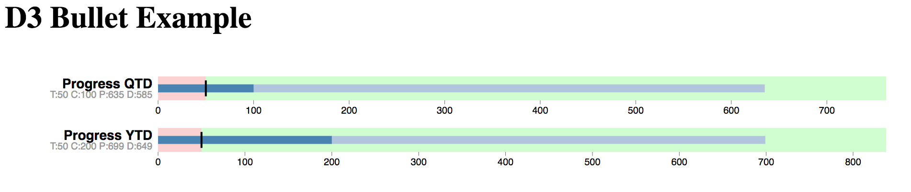

# D3 Bullet Chart

This Go library is based on work by [Mike Bostock](https://bl.ocks.org/mbostock) and inspired by work by Stephen Few.

* [Bullet Charts](https://bl.ocks.org/mbostock/4061961)
* [Stephen Few](http://www.perceptualedge.com/articles/misc/Bullet_Graph_Design_Spec.pdf)

Here is a screenshot from the green red example:



## Usage

See the [examples](https://github.com/grokify/gocharts/v2/charts/d3/d3bullet/examples).

Here is a quick synopsis:

```go
	timeNow := time.Now().UTC()

	bulletBuilderYTD := d3bullet.D3BulletChartBuilder{
		Title:    "Progress YTD",
		YTarget:  int64(50),
		YCurrent: int64(200),
		XStart:   tu.YearStart(timeNow).Unix(),
		XCurrent: timeNow.Unix(),
		XEnd:     tu.YearEnd(timeNow).Unix(),
	}
```